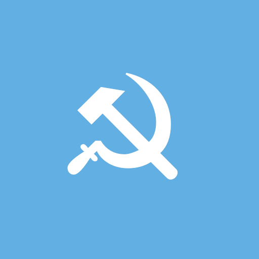

ЛОЛ ПРОВЕРКА ЧЕЛ ХАКЕР

---

<p align="center">
  
</p>

---

## 🌍 License and Philosophy: Open Collective Work (DCPSL v1.0)

This project is built and developed on the principles of digital communism, peer-to-peer cooperation, and absolute equality!

* **True Equality:** We reject corporate hierarchies and managers. Every comrade who contributes, patches, or refactors the code automatically becomes a full and equal co-author of the unified project.
* **Protection from Capitalist Misappropriation:** Our code is socialized under a strict reciprocity rule. Any attempt by commercial monopolies to steal our work, close the source, or hide it behind paywalls automatically voids their license, turning them into software pirates liable for immediate legal action and severe financial penalties.
* **No Censorship or Gatekeeping:** Got a cool new feature or widget? Edit the code and push it directly. The system automatically merges safe contributions into the core, making them immediate collective assets of humankind.

The full legal text of the contract is available in the [LICENSE](./LICENSE) file. Join the Digital Communist Party of Software! 🚩

---

## 🚩 Theoretical & Economic Foundation (TEO)

### 1. The Crisis of Capitalist Open Source
Modern open-source licenses (MIT, Apache, BSD) are broken. They simulate freedom but act as tools for capital accumulation. Corporations extract free labor from thousands of independent open-source developers, package it into proprietary clouds, and lock it behind subscription paywalls. This is the **alienation of digital labor**. 

### 2. Cyber-Communism & Code Socialization
DCPSL v1.0 completely abolishes corporate gatekeeping and the commodification of code through two core principles:
* **The Software Trust:** All contributions lose their fractional individual ownership and merge into an *indivisible collective asset* managed by the Mutual Aid Fund. You cannot "buy out" or "privatize" a piece of this repository.
* **Strict Copyleft Counter-Attack:** Under Article 2.2, anyone can use our code, but if a commercial monopoly attempts to encapsulate it inside a closed ecosystem, their license is instantly revoked. They become software pirates liable for severe financial and court penalties (Astraint).

### 3. "From Each According to His Ability..."
We reject managers and hierarchy. Every comrade who submits a patch, adds a widget, or fixes a bug automatically gains equal status as a co-author of the entire unified system. The code exists solely for the collective progress of humankind, completely immune to capitalist misappropriation.

---

⚠️ Important Notice: By submitting a Pull Request to this repository, you explicitly and unconditionally agree that your contribution is socialized under the terms of the DCPSL v1.0 license and becomes part of the indivisible collective asset.

---

<p align="center">
  
</p>

---

```text
                DIGITAL COMMUNIST PARTY SOFTWARE LICENSE (DCPSL)
                       Version 1.0 — September 2026

THE COMMUNIST MANIFESTO OF THE SOFTWARE (PREAMBLE)
The traditional software system is broken by capitalist monopolies that alienate developers from their labor. This License permanently socializes code, completely abolishing corporate hierarchy and the commodification of software. Grounded in the absolute principle: "From each according to his ability, to each according to his need", this Work exists solely for the collective progress of society. All contributors work as free and equal comrades within the Digital Communist Party.

LEGAL TERMS AND CONDITIONS (PUBLIC OFFER CONTRACT)

ARTICLE 1. LEGAL STATUS OF THE PARTY SOFTWARE TRUST
1.1. This License is a legally binding international public offer contract. Any act of copying, modifying, distributing, or running this Software (hereinafter referred to as the Work) constitutes full and unconditional acceptance of all terms herein.
1.2. The Work is developed through equal, open, and collective joint labor. To secure the project against capitalist misappropriation, all contributors agree to treat the unified Work as an indivisible, non-fractional collective asset managed by the collective Digital Communist Party Software Mutual Aid Fund (hereinafter referred to as the Fund).
1.3. For the sole purpose of international enforcement and judicial representation, the exclusive right to defend this License in courts of law is centralized and vested in the Project Initiator and their legally designated representatives acting on behalf of the Fund. The Project Initiator is identified as the original creator of the primary repository base or their legal successors.

ARTICLE 2. THE CONDITIONAL GRANT AND RECIPROCITY OBLIGATION
2.1. The usage and distribution rights granted under this License are strictly contingent upon the absolute rule of Collective Reciprocity (Strict Copyleft):
2.2. Any derivative work, library extension, modification, or software module/plug-in that directly incorporates, imports, extends, or is built specifically to expand the functionality of this Work MUST be distributed exclusively under this exact DCPSL v1.0 contract. Its full, open, and unencrypted source code must be made universally accessible to the public. This obligation does not extend to the underlying operating system or independent, unrelated software applications that merely execute alongside the Work.
2.3. The introduction of digital restrictions (DRM), subscription paywalls, closed-source compilation, or encryption of any part of the source code is a material breach of this Contract. Upon such violation, the license granted to the infringer is automatically and immediately terminated without prior notice. Further use of any part of the Work constitutes illegal copyright infringement and software piracy.

ARTICLE 3. PROCEDURAL STANDING AND JUDICIAL PROTECTION
3.1. The Project Initiator, acting on behalf of the Fund, possesses absolute, direct, and independent legal standing (Locus Standi) to enforce this contract against any infringer in any court of law.
3.2. In the event of a material breach by a commercial entity, the Project Initiator shall file a lawsuit for copyright infringement, commercial piracy, and breach of contract. The remedies sought shall include:
  a) An immediate and permanent injunction to halt the reproduction, distribution, and commercial sales of the infringing software product;
  b) Statutory damages and financial compensation for unauthorized use of intellectual property.
3.3. The infringer may purge the breach and petition for the restoration of the license solely by complying with Article 2.2 and releasing the complete, unencrypted source code of the derivative product into the public domain under the DCPSL v1.0.

ARTICLE 4. CODE INTEGRITY AND PROTECTION AGAINST SABOTAGE
4.1. The collective community reserves the absolute right to reject or remove code that compromises system stability. The intentional introduction of malicious software, spy-modules, or hidden telemetry is defined as a violation of computer security laws and contract breach.
4.2. Unintentional bugs or coding errors carry zero civil or financial liability for the author and shall be resolved through collective, non-hierarchical peer assistance.

ARTICLE 5. INTERNATIONAL DISCLAIMER OF WARRANTIES
THE SOFTWARE IS PROVIDED "AS IS", WITHOUT WARRANTY OF ANY KIND, EXPRESS OR IMPLIED. IN NO EVENT SHALL THE PARTY MEMBERS, THE COMMUNE, THE FUND, OR THE PROJECT INITIATOR BE LIABLE FOR ANY CIVIL CLAIMS, PROPERTY DAMAGE, OR UTILITY FAILURES ARISING FROM THE USE OF THIS CODE.

                     END OF TERMS AND CONDITIONS

```

* **Comrade [@w1n4a](https://github.com)** joined the commune!
